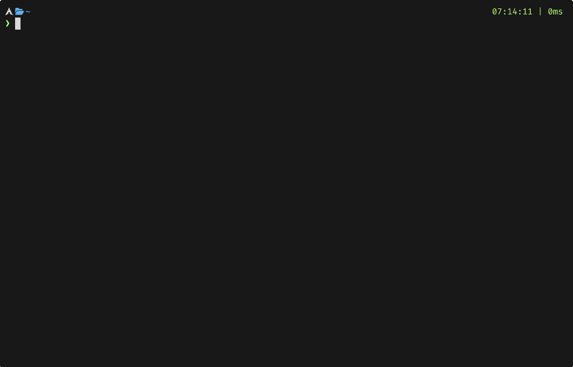
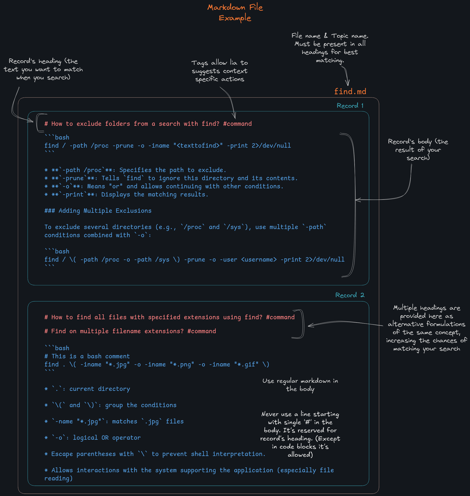

# lia. 

**lia** offer fast and accurate natural language access to a
personal knowledge base directly from the command line. It combines a simple
file structure (Markdown files) with a background semantic search engine powered
by a local transformer model. **lia** is a full local and offline solution.

Search example in knowledge base with lia: 



## Why ?
This project was born while looking for a satisfying way to gather all kinds of
information and easily access them. Today, the real challenge is no longer
whether the information exists or is accessible, but rather where it lives among
the mountains of data that surround us.

I built this tool as part of my journey learning cybersecurity, a field where
you're quickly overwhelmed by information: shell commands, procedures,
protocols, payloads, exploits, write-ups, notes, etc... It's the kind of
environment where you constantly find yourself thinking, “Wait, how did I do
that last time?" :thinking:

I’ve tried all kinds of knowledge base managers, but none truly met my needs.
What I was looking for was simple: a single place to search —so I don’t have to
remember where things are— and a system that understands my queries better than
basic keyword search which often misses the mark because we rarely remember the
exact terms. In contrast, semantic search delivers relevant results even when
the phrasing is vague.

With **lia**, I no longer need separate tools or storage systems, for cheat
sheets, notes, payload lists, how-tos... My entire knowledge base is searchable
the same way, in natural language.

Oh, and also, I think it's complete overkill to use massive LLMs just to ask
the same trivial question ten times, I prefer to have customized answers with
my own understanding and my personals tips.

## What lia Is Not

**lia** is not a ready-made knowledge base filled with prewritten answers. It is a
search and retrieval system — a tool designed to help you access your own
knowledge efficiently. The strength of **lia** lies in the quality of the content
you create. That means it's up to you, the user, to write your notes,
explanations, and tips in your own words. This may require effort, but it
ensures that your knowledge base will be deeply relevant, personally meaningful,
and aligned with your way of thinking. **lia** doesn't try to replace your
understanding — it amplifies it by making your insights instantly searchable.
The more you invest in crafting your own material, the more precise and helpful
**lia** becomes.

---

## Table of Contents

- [Quick start](#quick-start)
  - [Using lia (in 5 seconds)](#using-lia-in-5-seconds)
  - [How to structure your knowledge base](#how-to-structure-your-knowledge-base)
- [Installation](#installation)
  - [About disk usage](#about-disk-usage)
  - [Pipx install](#pipx-install)
  - [Install from sources](#install-from-sources)
    - [Step by step installation and run](#step-by-step-installation-and-run)
  - [Docker install](#docker-install)
    - [Step by step installation and run](#step-by-step-installation-and-run-1)
    - [Tip: Bind your local knowledge base](#tip-bind-your-local-knowledge-base)
    - [Development with docker](#development-with-docker)
    - [Remove from docker](#remove-from-docker)
- [Overview](#overview)
  - [Transformer model](#transformer-model)
  - [lia daemon](#lia-daemon)
  - [Hardware configuration](#hardware-configuration)
  - [Supported languages?](#supported-languages)
  - [System compatibility](#systeme-compatibility)
- [Features](#features)
  - [Summary of Commands](#summary-of-commands)
  - [Search](#search)
    - [Search history](#search-history)
    - [Search result](#search-result)
  - [Topics](#topics)
    - [List topics](#list-topics)
    - [Show topic content](#show-topic-content)
  - [Reviews (experimental)](#reviews-experimental)
    - [List reviews](#list-reviews)
    - [Review session](#review-session)
    - [How it works](#how-it-works)
- [Ackowledgements](#acknowledgements)

---

## Quick start
### Using lia (in 5 seconds) 

- You'll need a knowledge base : **one file = one topic**. No file hierarchy, no
folders, no tags, no links. Just plain files like : `bash.md`, `xxe.md`,
`jwt.md`, `gobuster.md`, `smb.md`, etc. Keep it simple.
- Enter `lia` in commande line.
- When prompted, enter a **search query containing the topic name** : ***"How to
extract a range of lines from a file in **bash**?"***. 

### How to structure your knowledge base



- Take a look at [Markdown Sample](./doc/bash.md)

- An `undefined.md` file is included by default in **lia**'s knowledge base. It
serves as a place to store records that don’t yet have a clearly defined topic
or are temporarily awaiting enough related content to justify creating a
dedicated file. As there is no specific topic related records in `undefined.md`,
this file is parsed for each query.

- **Keep topic files as specific as possible.** Avoid using generic topics like
`vulnerabilities.md`; instead, prefer specific topic files like `xxe.md`, `sqli.md`,
etc.  As soon as you have at least two records on a particular subtopic, group
them into a new dedicated topic file.  For example, if your `bash.md` file
starts to contain several `find` command entries, create a separate `find.md`
topic file.

- **Prefer records in the form of short, focused question/answer pairs.** Each
should cover a well-defined scope—a small, precise, and relevant piece of
knowledge that's easy to digest.

- **Writing notes in one's own words** forces you to ask questions and delve
deeper, which improves both memory and understanding.

#### About tags
> **Tags are not meant for user-facing classification but help lia provide relevant actions based on the content type.**

Currently, two tags are supported in **lia**:

- `#command`: 
  - This tag offers the user the possibility to mark a record as containing
  command(s). If this tag is present in the record, **lia** will propose to copy all
  commands directly to the clipboard.
  - Every single line in a code block (as parsed from markdown) is considered a
  **command**, except those starting with a comment character (`#`, `//`,
  `--`, or `;`).
  - If a clipboard manager is present, commands copied by **lia** will appear as
  a separate entry.  Otherwise, only the **first** command in the record will be
  available in the clipboard.

- `#script`: 
  - This tag offers the user the possibility to mark a record as containing
  script(s). If this tag is present in the record, **lia** will propose to copy all
  scripts directly to the clipboard.
  - Every code block (as parsed from markdown) is considered a **script**.
  - If a clipboard manager is present, scripts copied by **lia** will appear as
  a separate entry.  Otherwise, only the **first** script in the record will be
  available in the clipboard.


---

## Installation 
### About disk usage
The total disk usage (~5 GB) which is relatively significatnt comes from two main
sources: the Python dependencies and the pretrained paraphrase model. The bulk
of the dependencies is due to sentence-transformers, which pulls in heavy
machine learning libraries like transformers and torch. On the other hand, the
paraphrase model itself (≈1 GB) is stored separately and loaded into memory when
needed during inference. This architecture allows efficient runtime usage, even
though the initial installation is relatively large.

### Pipx install
- Download wheel package
- Install with pipx : 
```
pipx install lia-<version>-py3-none-any.whl
```

--- 

### Install from sources

#### Step by step installation and run 

##### 1. Install [`uv`](https://github.com/astral-sh/uv) – a fast Python dependency manager:

```bash
curl -LsSf https://astral.sh/uv/install.sh | sh
```
Or on Arch linux : 
```
sudo pacman -s python-uv
```

Add `uv` to your shell environment:

```bash
source $HOME/.local/bin/env
```

##### 2. Install lia

```bash
git clone https://gitlab.com/piergstg/lia.git
cd lia
```

From the root of the project (where `pyproject.toml` is located):

```bash
uv sync
```

This will:

* Create a virtual environment in `.venv/`
* Install all dependencies defined in `pyproject.toml`

##### 3. Run `lia`

Activate the environment:

```bash
source .venv/bin/activate
```

Then run the CLI:

```bash
lia
```

On first run, `lia` will:

* Download the `SentenceTransformer` model (\~1GB)
* Start the interactive CLI or respond to your command

You are now ready to use `lia` locally.

##### 4. Running tests

From the root of the project : 

```bash 
uv run pytest
```

For coverage report use : 
```bash
source .venv/bin/activate
coverage run -m pytest
coverage report
coverage html
```

--- 

### Docker install

For now, the Docker image is kept minimal — it does not include dependencies or
the transformer model — and is intended for development use. A manual setup is
required on the first run, but all data is persisted via volumes, making
subsequent runs instant. A more self-contained image may be provided later.

#### Step by step installation and run
##### 1. Start the container

From the root of your project, run:

```bash
cd docker
docker-compose up -d
```

This will:

* Build the image (if needed)
* Start a container named `lia`
* Mount all the necessary files and volumes

##### 2. Access the container

Once the container is running, enter it with:

```bash
docker exec -it lia bash
```

You now have a bash shell inside the `lia` container.

##### 3. Inside the container (manual first-time setup)

In the container, run the following:

```bash
cd /app
uv sync
```

This will:

* Create the virtual environment at `/app/.venv`
* Install all project dependencies 
* Due to transformer dependencies it takes around 5Gb of data

Then activate the environment:

```bash
source .venv/bin/activate
```

Finally, launch `lia`:

```bash
lia
```

On first run, this will:

* Download the `SentenceTransformer` model (\~1 GB)
* Start the CLI tool

You are now ready to use `lia` inside the container.

#### Tip: Bind your local knowledge base

If you want to use your **local knowledge base** inside the container (instead of the default `docker/data`), follow these steps:

##### 1. Stop and drop container 

```bash
docker-compose down
```

##### 2. Replace the data directory

```bash
cd docker
rm -rf data
ln -s /absolute/path/to/your/local/data ./data
```

##### 3. Restart the container

```bash
docker-compose up -d
```

Your local knowledge base is now mounted inside the container at:

```bash
/root/.local/share/lia/data
```
--- 

#### Development with docker
Source files are directly binded from the project into the container. This
allows you to edit the code locally and immediately use or test it inside the
container without rebuilding or restarting it.

--- 

#### Remove from docker 
```bash
docker rm lia
docker rmi lia
docker volume rm lia-cache lia-transformer-cache lia-uv-share lia-venv
```

---

## Overview 

### Transformer model
At the core of lia’s search capability is a semantic similarity engine. Instead
of relying on simple keyword matching, **lia** uses a transformer model to
understand the *meaning* behind your query.

**lia is entirely local and offline**, no external APIs or cloud-based
components are used. Everything stays on your machine, ensuring both privacy and
speed.

### lia daemon
Running the model in a long-lived background process avoids startup latency and
keeps the CLI responsive. Once model is downloaded, the first start can take few
seconds to load the model, and subsequent queries are nearly instantaneous :  
- When **lia** starts, a background **daemon** is launched.
- This daemon loads a lightweight transformer-based sentence embedding model.
- When you perform a search, **lia** computes similarity scores between your
query and all records headings in topic files matched by a keyword in the query.
- The top matching entries are returned and displayed in the CLI with clean
markdown formatting.


### Hardware configuration
I developed **lia** and daily use it on an old Dell XPS from 2017, which run a i7
CPU with 16GB RAM and GPU NVIDIA GTX1050. Response times are under 500ms for
files with around a hundred records, and around 2–3 seconds for files with
approximately 500 records — which, in my usage, should never happen under normal
circumstances, as such a high number of records in a single topic file usually
indicates that the topic is poorly segmented.

### Supported languages?

**lia** supports multilingual capabilities in two key ways. 

First, it is fully compatible with the 50+ languages supported by the
`paraphrase-multilingual-mpnet-base-v2` model, meaning it can understand and
process queries in a wide range of languages.

Second, **lia** allows *cross-lingual querying*. This means you can ask a question
in one language (e.g., English) and retrieve relevant results from a knowledge
base written in another language (e.g., French, Spanish, or Arabic). This is
possible thanks to the multilingual embedding space shared across languages,
which enables semantic similarity comparisons regardless of the language used.

- Albanian
- Arabic
- Armenian
- Bulgarian
- Burmese
- Catalan
- Croatian
- Czech
- Danish
- Dutch
- English
- Estonian
- Finnish
- French
- Galician
- Georgian
- German
- Greek
- Gujarati
- Hebrew
- Hindi
- Hungarian
- Indonesian
- Italian
- Japanese
- Korean
- Kurdish
- Latvian
- Lithuanian
- Macedonian
- Malay
- Marathi
- Mongolian
- Norwegian Bokmål
- Persian
- Polish
- Portuguese
- Romanian
- Russian
- Serbian
- Slovak
- Slovenian
- Spanish
- Swedish
- Thai
- Turkish
- Ukrainian
- Urdu
- Vietnamese

### System compatibility
**lia** has been tested on Arch linux, Debian, and with Ubuntu in Windows WSL2.

**lia** is fully compatible with WSL2 on Windows. However, to ensure proper display of Unicode and Nerd Font glyphs (used for enhanced readability and UI hints), you must use a terminal that supports them properly.

You can use one of the following terminals:
- **Alacritty** (fast, GPU-accelerated, excellent font rendering)
- **Kitty** (GPU-based and feature-rich)

Make sure to install a monospace [Nerd Fonts](https://www.nerdfonts.com/font-downloads) on your Windows system before launching your terminal.  Once installed, configure your terminal to use the Nerd Font explicitly in its settings.

---

## Features

### Summary of Commands

| Command              | Description                                    |
| -------------------- | -----------------------------------------------|
| `lia`                | Launch interactive prompt for searches         |
| `lia list -t`        | List all topics                                |
| `lia list -r`        | List all review groups (experimental)          |
| `lia show <topic>`   | Show contents of a given topic                 |
| `lia review <topic>` | Start review session for a topic (experimental)|
| `lia stop`           | Stop **lia** daemon                                |

--- 

### Search

```bash
lia
```

Running `lia` with no arguments launches an interactive prompt to query your
knowledge base in natural language.

#### Search history
Every question you ask is stored locally. You can navigate previous queries with ↑ / ↓.

#### Search result
Query results are rendered with several productivity features:

- **Search results in are rendered using rich Markdown formatting directly in
the CLI**.  Additionally, **image support is available when using Kitty
terminal.** In this case, **lia** can display inline images directly within the
CLI output, allowing for a more visual and informative experience. 
For other terminals, the image section is gracefully replaced by clickable link.

- **Similar answer suggestion**: When you run a query, **lia** identifies the
most relevant match based on semantic similarity and returns it as the main
answer. But behind the scenes, it also keeps track of the top 3 results by
similarity score. The **second and third best matches** are shown as **"similar
answers"**, which you can instantly explore from the main result. This helps you
discover related content or edge cases that might be just as useful as the top
match—especially when multiple entries are closely relevant.

- **Copy to clipboard**: Whenever a knowledge base entry is tagged with
`command`, or `script`, **lia** detects it and automatically adds a
**copy action** in the search result output. This allows you to copy the
relevant command(s) or script(s) directly to your clipboard.

---

### Topics
#### List topics

```bash
lia list --topics
# or
lia list -t
```

Lists all available topics in your local knowledge base (it matches every *\<topic\>.md* file).

#### Show topic content

```bash
lia show <topic>
```

Displays all records headings under a specific topic.

--- 

### Reviews (experimental)

The **Reviews system** is an experimental feature that turns your knowledge base
into an interactive flashcard-like tool—without needing to duplicate content
into any external app.

#### List reviews

```bash
lia list --review-groups
# or
lia list -r
```

Lists all review groups (i.e., collections of topics scheduled or available for review).

#### Review session

```bash
lia review <topic>
```

Starts a review session for the selected topic. The review session tests your memory by prompting you with content drawn directly from your existing knowledge base.


####  How it works

The review feature is experimental and intentionally kept simple for now:

- **Auto-generated flashcards**: **lia** doesn't rely on manually crafted Q/A pairs.
Instead, it uses the records already present in your knowledge base as prompts.
This allows a flashcard-style interactions.

- **Fixed-size groups**: Each topic file is divided into review groups of **7
consecutive records**. These are treated as logical flashcard units. To maintain
consistency across review sessions, **always append new records to the end** of
topic files. (Why 7? In my usage, I found it to be a good compromise — not too
few, not too many — for effective learning cycles.)

- **Spaced repetition scheduling**: Each review is timestamped and managed with
a simple schedule based on memory reinforcement intervals:
  - **J+1** (1 day later)
  - **J+2** (2 days later)
  - **J+7** (7 days later)
  - **J+20** (20 days later)

This approach supports long-term memorization through spaced recall.

---

### Handling the lia daemon

As previously explained, the **lia** daemon runs the sentence similarity engine (and its underlying model) in a background process to avoid reloading the model for each query.
You can stop the daemon using the `lia stop` command. It will automatically restart the next time you run `lia` command.

---

## Acknowledgements

Before creating **lia**, I regularly used [kb](https://github.com/gnebbia/kb) by
Giuseppe Nebbione which is a CLI minimalist knowledge base manager.  Among the
available open source projects, it was the one that matched my workflow and
expectations the closest.

**lia** was initially inspired by kb's minimalist philosophy and CLI structure.
*Some parts of the command routing and architecture were influenced by how kb
*organizes its main entry point and subcommands.

The original kb project is licensed under the GNU General Public License v3.0,
and this project adheres to the same license.
