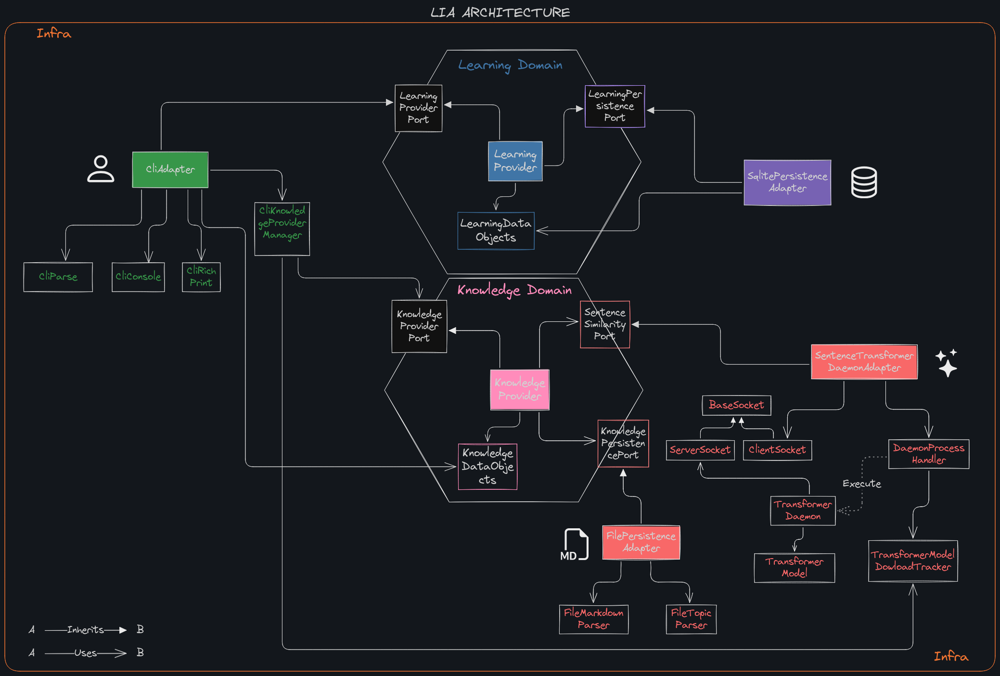

# lia Architecture
When I started building **lia**, I had a set of complemetary goals in mind.

First, I wanted to create my own personal knowledge base system—something
that would truly reflect *my way* of learning, thinking, and organizing
information.

Second, I wanted to learn and practice Python, a language I barely knew at the time.

Third, I saw this as an opportunity to apply and deepen my understanding of
**hexagonal architecture** (also known as ports and adapters).  I deliberately
chose to use this architecture even though it might seem a bit overkill for a
project of this size. After all, *Lia* is a command-line tool written in
Python—not exactly a language known for its strict object-orientation.

And yet... it turned out to be a great decision.

Implementing hexagonal architecture clearly separate concerns, isolate the
domain logic, and define boundaries between the core of the application and
external systems like file I/O, CLI interfaces, and the sentence similarity
engine.

This approach brought several benefits:

- **Strong decoupling**: The domain logic can evolve independently of the tools used to interact with it.
- **Testability**: The core logic can be tested in isolation, without worrying about external dependencies.
- **Maintainability**: Adapters are small, focused, and easy to replace or extend.
- **Clarity**: It’s always obvious what’s domain, what’s infrastructure, and where the boundaries lie.
- **Flexibility**: Adding a new type of interface would require no changes to the domain logic—just a new adapter. And that’s really cool.

In short, Lia is not just a personal tool—it’s also been a playground for learning python app practising clean architecture. And that’s part of what makes it fun.

